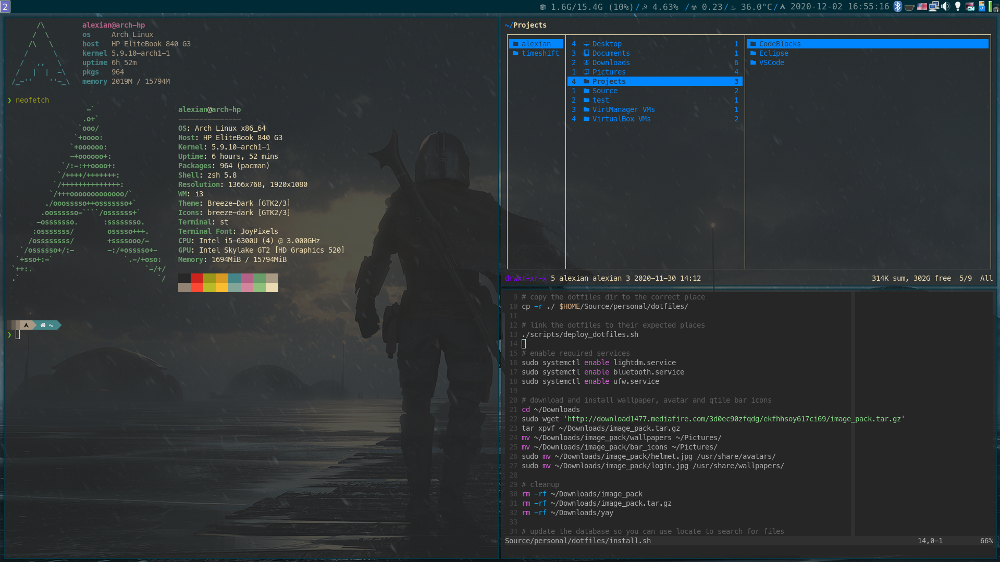
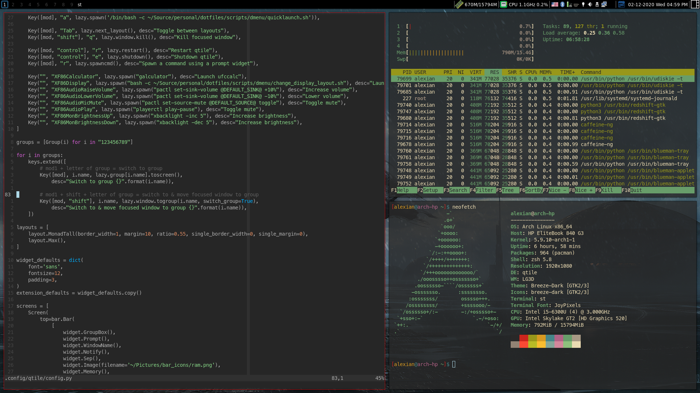
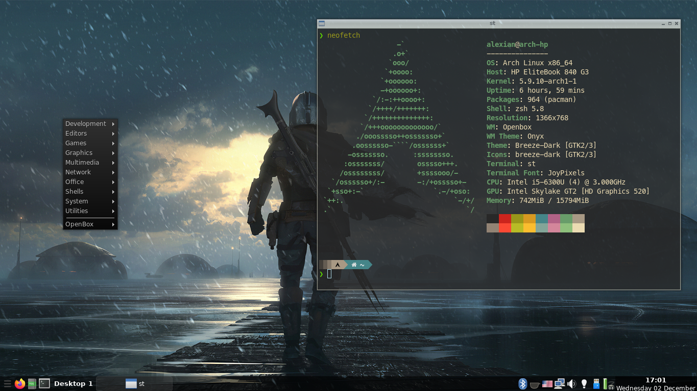

# Arch Linux Dotfiles 
 &nbsp;&nbsp;&nbsp;  &nbsp;&nbsp;&nbsp;  &nbsp;&nbsp;&nbsp; 
<h2>DESCRIPTION</h2> 

This is a work-in-progress setup of Arch Linux on a laptop with 3 window managers: i3, Qtile and OpenBox.

It is meant to be used on a fresh install of Arch Linux, with a user account and networking already configured (the networkmanager package must be installed and the NetworkManager service must be enabled).

I might make an install script for the OS itself in the future.

<h2>INSTALLATION</h2> 
<h3>Requirements: git, base-devel, systemd and an internet connection</h3>

Run the following commands in a tty:

&nbsp;&nbsp;&nbsp;&nbsp;&nbsp;&nbsp;git clone https://github.com/Alexian123/dotfiles

&nbsp;&nbsp;&nbsp;&nbsp;&nbsp;&nbsp;cd ./dotfiles

&nbsp;&nbsp;&nbsp;&nbsp;&nbsp;&nbsp;./install.sh

Enter your password when asked (required to install dependencies).

<h2>IMPORTANT INFORMATION</h2> 
<ul>
    <li>Enable multilib.</li>
    <li>Do not run the install script as root!</li>
    <li>Do not move, delete or rename the ~/Source/personal/dotfiles directory or its parents, as all the system configs will be linked to it.</li>
    <li>Your monitor setup will most likely be different from mine, so replace the files from ./screenlayout with ones that work properly for your setup. You can generate those using arandr, just make sure to save them in the right place (~/Source/personal/dotfiles/screenlayout). You may need to set up lightdm to use one of those files in case it doesn't use the correct resolution by default.</li>
    <li>You likely need different video drivers (by default, only intel drivers are installed). Make sure you look through the OPTIONAL section at the top of           ./package_list.txt and replace what you don't need with what you do need. Unless you know what you're doing, do not modify other sections.</li>
    <li>Aappend 'QT_QPA_PLATFORMTHEME=qt5ct' to /etc/environment to be able to set the qt theme with qt5ct.</li>
</ul>

<h2>POST INSTALATION</h2>

To get the latest configs, run 'cd  ~/Source/personal/dotfiles && git pull'.

You may also need to use different keyboard layouts, so modify the gxkb config file (~/Source/personal/dotfiles/gxkb/gxkb.cfg).

Don't forget to set your wallpaper with nitrogen. You can find some pre-installed wallpapers in ~/Pictures/wallpapers.

The first time you run nvim you should run ':PlugInstall'.

Lastly, consider changing your default shell to zsh using 'chsh'.

<h1>GALLERY</h1>
<h2>i3</h2>

<h2>Qtile</h2>

<h2>OpenBox</h2>

